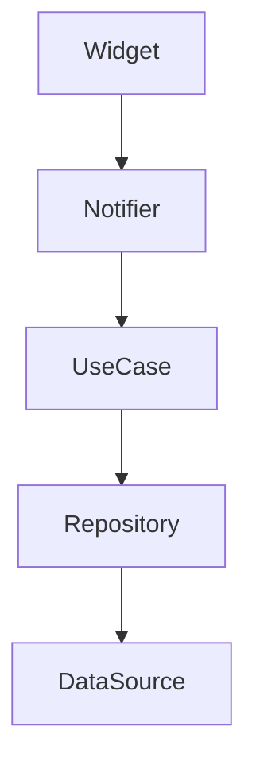
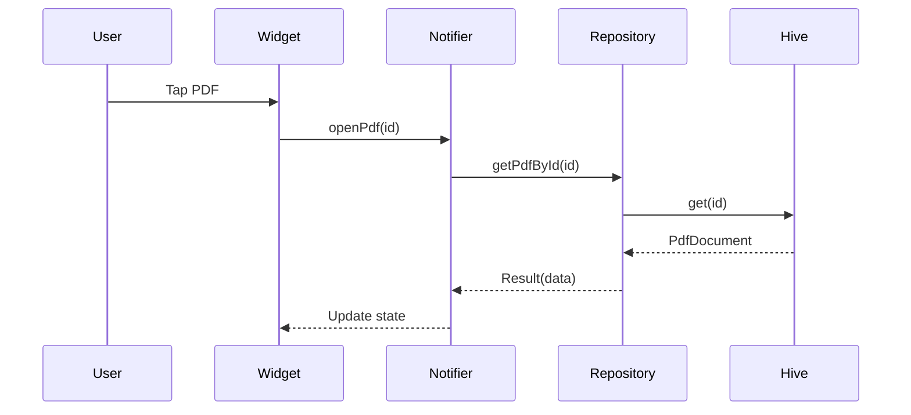

# Documentation Guidelines

This file defines documentation standards for code, features, and the project.

---

## Documentation Principles

1. **Code is documentation** - Write self-documenting code first
2. **Document why, not what** - Explain decisions, not obvious code
3. **Keep it current** - Update docs when code changes
4. **Be concise** - Less is more when it comes to comments

---

## Dart Documentation Comments

### Public API Documentation

All public APIs MUST have documentation comments:

```dart
/// A repository for managing PDF documents in local storage.
///
/// This repository uses Hive for persistence and provides
/// CRUD operations for PDF metadata.
///
/// Example:
/// ```dart
/// final repo = SharedPreferencesPdfRepository();
/// final result = await repo.getAllPdfs();
/// result.when(
///   success: (pdfs) => print('Found ${pdfs.length} PDFs'),
///   failure: (error) => print('Error: $error'),
/// );
/// ```
class PdfRepository {
  /// Returns all PDF documents stored locally.
  ///
  /// Returns a [Result] containing either a list of [PdfDocument]
  /// on success, or an [AppFailure] on error.
  ///
  /// Throws nothing - all errors are wrapped in Result.
  Future<Result<List<PdfDocument>>> getAllPdfs() {
    // Implementation
  }
}
```

### Documentation Comment Format

```dart
/// Single line summary (one sentence, ends with period).
///
/// Additional details if needed. Can be multiple paragraphs.
///
/// Example:
/// ```dart
/// final value = myMethod();
/// ```
///
/// See also:
/// - [RelatedClass]
/// - [relatedMethod]
///
/// Throws [SomeException] if the operation fails.
/// Returns the calculated value.
ReturnType myMethod() {
  // Implementation
}
```

### When to Document

| Element | Required | Example |
|---------|----------|---------|
| **Public classes** | ✅ Yes | `/// Manages PDF library state` |
| **Public methods** | ✅ Yes | `/// Loads all PDFs from storage` |
| **Public fields** | ✅ Yes | `/// The currently selected PDF` |
| **Private methods** | ❌ No | - (use descriptive names) |
| **Getters/setters** | ⚠️ Sometimes | If not obvious from name |
| **Parameters** | ⚠️ Sometimes | If not obvious from name/type |

---

## Code Comment Guidelines

### DO: Explain Non-Obvious Things

```dart
// ✅ GOOD - Explains WHY
// Using withValues instead of withOpacity to avoid deprecated warning
// See: https://github.com/flutter/flutter/issues/93912
final color = primaryColor.withValues(alpha: 0.5);

// ✅ GOOD - Explains non-obvious logic
// Check null first because accessing isEmpty on null throws error
if (data == null || data.isEmpty) return;

// ✅ GOOD - Documents workaround
// TODO: Remove this sync block once Hive supports async operations
// Issue: https://github.com/hivedb/hive/issues/xxx
synchronized(() => box.put(key, value));
```

### DON'T: Repeat What Code Says

```dart
// ❌ BAD - Obvious from code
// Get the PDF with the given ID
final pdf = getPdfById(id);

// ❌ BAD - Code is self-explanatory
// Check if list is empty
if (pdfs.isEmpty) return;

// ❌ BAD - Useless comment
// Increment counter
count++;
```

### DON'T: Comment Out Code

```dart
// ❌ BAD - Commented code should be deleted
// final oldMethod = () {
//   print('old');
// };

// ✅ GOOD - Delete unused code, git has the history
final newMethod = () {
  print('new');
};
```

---

## Inline Documentation for Complex Logic

```dart
/// Parses a PDF file and extracts metadata.
///
/// The process involves:
/// 1. Opening the file at [filePath]
/// 2. Reading the PDF header for page count
/// 3. Extracting title if available
/// 4. Generating a thumbnail
///
/// Throws [PdfException] if the file is corrupted or invalid.
Future<PdfMetadata> parsePdf(String filePath) async {
  // Step 1: Validate file exists and is readable
  final file = File(filePath);
  if (!await file.exists()) {
    throw PdfException('File not found: $filePath');
  }

  // Step 2: Read PDF header (first 4 bytes must be %PDF)
  final header = await file.openRead(0, 4).first;
  if (utf8.decode(header) != '%PDF') {
    throw PdfException('Invalid PDF file');
  }

  // Step 3-4: Extract metadata and generate thumbnail
  // ... implementation
}
```

---

## File Headers

Only add file headers for files with specific legal requirements or special notes:

```dart
// Copyright (c) 2025. All rights reserved.
// Use of this source code is governed by MIT license.

/// Provides PDF repository implementations.
///
/// This file contains the concrete implementation of [PdfRepository]
/// using SharedPreferences for persistence.
library;
```

For most files, skip the header and start with a library doc if needed:

```dart
/// Library screen UI and state management.
library;
```

---

## README Documentation

### Project README Structure

```markdown
# Project Name

Brief description (2-3 sentences).

## Features
- Feature 1
- Feature 2

## Getting Started

### Prerequisites
- Flutter 3.38.5+
- Dart 3.10.4+

### Installation
```bash
git clone <url>
cd project
flutter pub get
flutter run
```

## Project Structure
Brief overview of folders

## Development
### Running tests
### Building for release

## Contributing
Guidelines for contributors

## License
MIT or similar
```

---

## Feature Documentation

Create `FEATURE.md` when starting a complex feature:

```markdown
# PDF Bookmark Feature

## Overview
Allow users to save and restore reading positions in PDFs.

## Requirements
- Add bookmark at current page
- View all bookmarks for a PDF
- Jump to bookmarked page
- Delete bookmarks
- Persist bookmarks locally

## Implementation Plan
1. Update PdfDocument model to include bookmarks
2. Add Bookmark class (page number, timestamp, optional note)
3. Create bookmark repository
4. Implement bookmark use case
5. Add bookmark UI to reader screen
6. Add bookmarks list to library

## Technical Decisions
- Using Hive for persistence (same as other data)
- Bookmarks stored as List<int> page numbers in PdfDocument
- UI: Bottom sheet for quick access, dedicated screen for management

## Status
- [ ] Model updated
- [ ] Repository created
- [ ] Use case implemented
- [ ] UI designed
- [ ] Tests written
- [ ] Documentation updated
```

---

## API Documentation (Internal)

Document complex internal APIs:

```dart
/// Result type for operations that can fail.
///
/// This is a type-safe alternative to throwing exceptions.
/// Use this for all operations that can fail at runtime
/// (network, file I/O, parsing, etc.).
///
/// **Usage pattern:**
/// ```dart
/// final result = await repository.getData();
/// result.when(
///   success: (data) => handleData(data),
///   failure: (error) => handleError(error),
/// );
/// ```
///
/// **Why not use exceptions?**
/// - Exceptions are invisible in type signatures
/// - Forces error handling at call site
/// - Makes error paths explicit in tests
abstract class Result<T> {
  // ...
}
```

---

## TODO Comments

Use TODOs for tracked work:

```dart
// TODO(username): Implement thumbnail generation
// https://github.com/org/repo/issues/123
Widget _buildThumbnail() {
  return const Placeholder();
}

// TODO(username): Remove this workaround after Flutter 3.50
// Current version has a bug with X: https://github.com/flutter/flutter/issues/xxxx
final workaround = _hackySolution();
```

Update CLAUDE.md with project-specific TODO guidelines:

```markdown
## TODO Guidelines

Format: `TODO(username): description [optional issue link]`

- Use TODOs for temporary solutions
- Always assign to a specific person
- Link to issue if available
- Remove TODO when resolved
```

---

## Diagrams

### Architecture Diagrams

Use Mermaid for documentation:

```markdown
## Architecture



## Data Flow


```

---

## Changelog

Maintain `CHANGELOG.md`:

```markdown
# Changelog

All notable changes to this project will be documented in this file.

## [Unreleased]

### Added
- PDF bookmark functionality
- Dark mode toggle in settings

### Changed
- Improved thumbnail loading performance

### Fixed
- Crash when opening corrupted PDF files

### Removed
- Unused cloud sync feature

## [1.0.0] - 2025-01-15

### Added
- Initial release
- PDF library screen
- PDF reader with Syncfusion
```

---

## Documentation Checklist

- [ ] All public classes have doc comments
- [ ] All public methods have doc comments
- [ ] Complex algorithms have explanatory comments
- [ ] No commented-out code
- [ ] No obvious comments
- [ ] README is up to date
- [ ] CHANGELOG updated for releases
- [ ] Feature docs created for complex features
- [ ] API docs generated (dart doc)
```
